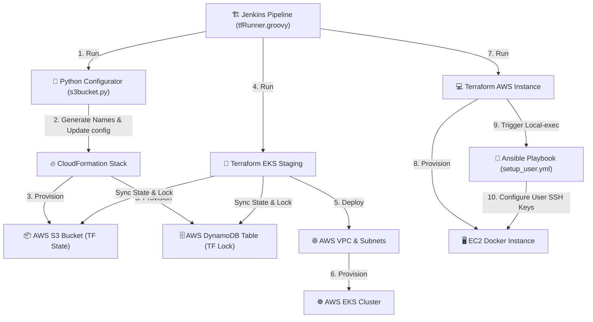

# AWS Sandbox (ACG)


## Terraform Kubernetes Solution

This repository contains Terraform code to deploy a Kubernetes-based Test application on AWS. The Terraform state is stored in an S3 bucket, and the state lock is managed using a DynamoDB table. Both the S3 bucket and the DynamoDB table are created using AWS CloudFormation.

---

## 📐 Architecture & Workflow Diagram

Below is the execution flow of the automation setup:



---

## Prerequisites

1. [Terraform](https://www.terraform.io/downloads.html) installed (version >= 1.0, recommended 1.9.0)
2. [AWS CLI](https://aws.amazon.com/cli/) installed and configured with appropriate credentials
3. [kubectl](https://kubernetes.io/docs/tasks/tools/install-kubectl/) installed (optional, to interact with the deployed Kubernetes cluster)

## Usage

1. Clone this repository:

```sh
git clone https://github.com/yourusername/<this-repo>.git
cd <this-repo>
```

2. Create the required S3 bucket and DynamoDB table using CloudFormation:

```sh
aws cloudformation create-stack --stack-name my-stack --template-body file://cloudformation/s3.yaml --parameters ParameterKey=S3BucketName,ParameterValue=my-s3-bucket ParameterKey=DynamoDBName,ParameterValue=my-lock-table
```

3. Update `backend.tf` with the S3 bucket and DynamoDB table names you provided as parameters when creating the CloudFormation stack:

```hcl
terraform {
  backend "s3" {
    bucket         = "my-s3-bucket"
    key            = "terraform.tfstate"
    region         = "us-west-2"
    dynamodb_table = "my-lock-table"
  }
}
```

4. Initialize Terraform:

```sh
terraform init
```

5. Review the Terraform plan and apply:

```sh
terraform plan
terraform apply
```

6. (Optional) To interact with the deployed Kubernetes cluster, configure `kubectl`:

```sh
aws eks update-kubeconfig --region us-west-2 --name my-cluster-name
```

7. To destroy the deployed infrastructure, run:

```sh
terraform destroy
```

## Providers

This project is configured to use the following provider constraints for stability:
* **AWS Provider**: `~> 4.0` (Pinned to avoid compatibility issues with EKS/VPC modules and AWS v5.x)
* **Vultr Provider**: Default latest
* **Template Provider**: `>= 2.1.2`

## CI/CD Pipeline

This repository has a built-in CI/CD pipeline managed via **GitHub Actions** ([.github/workflows/terraform.yml](file://.github/workflows/terraform.yml)):
* **Lint & Validate (CI)**: On every push and Pull Request, the pipeline runs code format check (`terraform fmt`) and code validation (`terraform validate`) using Terraform **1.9.0** for all sub-modules (staging, aws_instance, vultr-dev).

## Contributing

Contributions are welcome! Please feel free to submit a pull request or open an issue.
